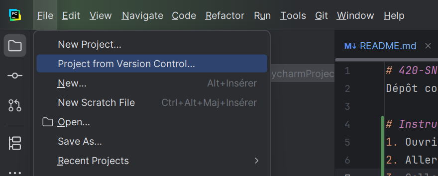
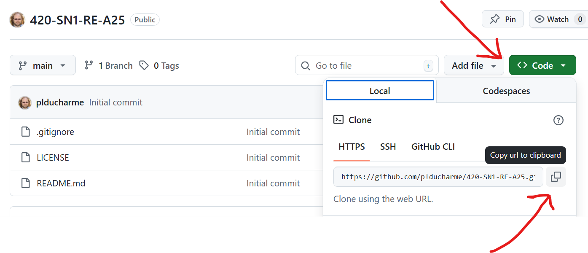
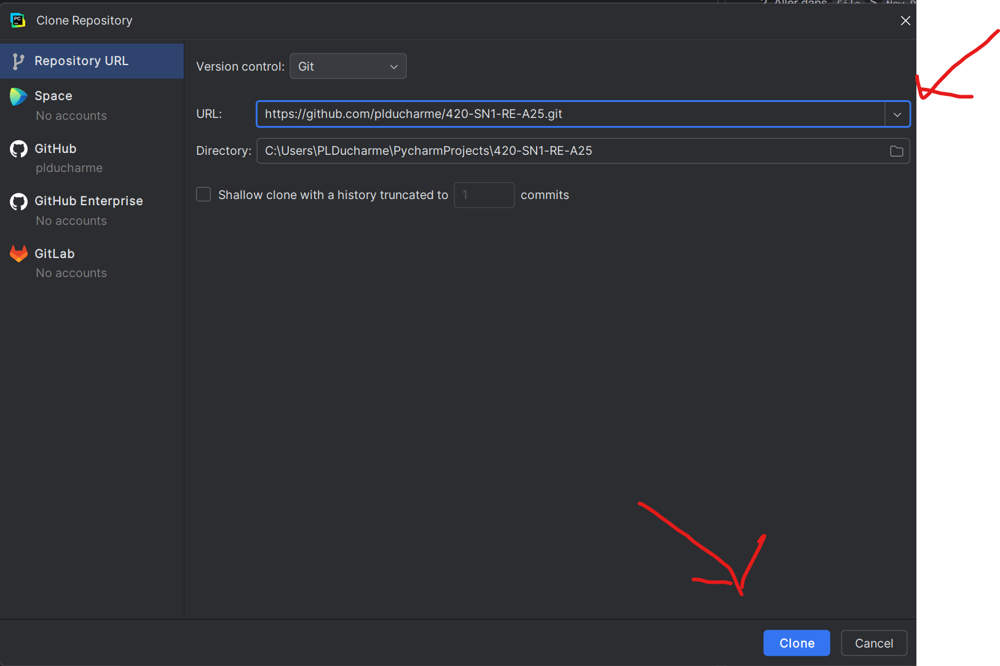
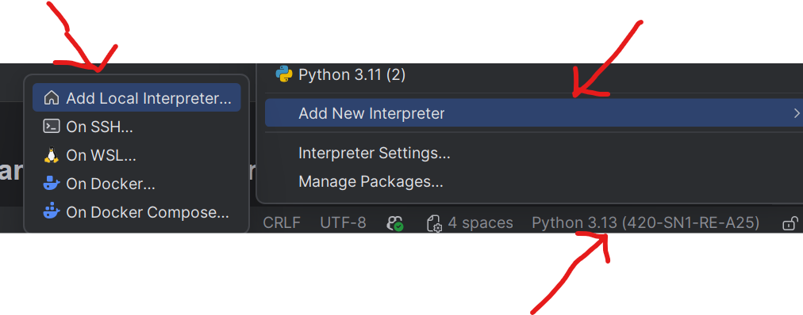
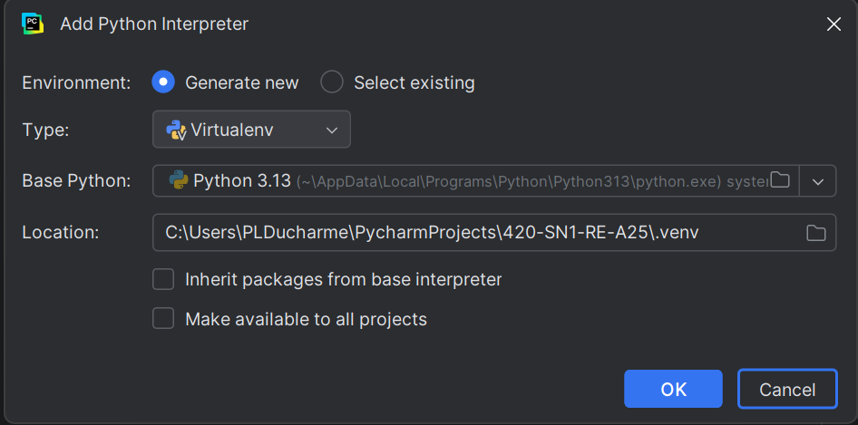

# 420-SN1-RE-A25
Dépôt contenant des exemples supplémentaires et des exercices

# Instructions pour cloner ce dépôt sur votre machine locale
1. Ouvrir PyCharm
2. Aller dans `File` > `New Project from Version Control...` 
3. Sur cette page, cliquer sur le bouton code en haut à droite du dépôt GitHub et copier l'URL du dépôt 
4. Coller l'URL dans PyCharm dans le champ `URL` et cliquer `clone`

## Optionnel, mais recommandé: Configurer un environnement virtuel
1. Cliquer sur `Python 3.13` (ou la version indiquée) en bas à droite de PyCharm et sélectionner `Add New Interpreter` -> `Add Local Interpreter` 
2. Choisir la dernière version de Python installée sur votre machine (ex: Python 3.13) et cliquer `OK` 
3. Vous avez maintenant un environnement virtuel configuré pour ce projet.

### Notes sur les environnements virtuels
Un environnement virtuel est un espace isolé sur votre machine où vous pouvez installer des package Python sans affecter les autres projets ou l'installation globale de Python. Cela permet de gérer les dépendances spécifiques à chaque projet.  

*Ex: si un projet nécessite une version spécifique d'une bibliothèque, vous pouvez l'installer dans l'environnement virtuel de ce projet sans interférer avec d'autres projets qui pourraient nécessiter une version différente de la même bibliothèque.*  

Pour plus d'informations, vous pouvez consulter la documentation officielle de Python sur les environnements virtuels: [venv documentation](https://docs.python.org/3/library/venv.html)

## Extras
Le dossier `extras` contient des exemples supplémentaires sur des sujets vus en classe et sur des sujets plus avancés qui ne seront pas vus en classe. Ces exemples sont là pour vous aider à approfondir vos connaissances en Python et en programmation en général.  
N'hésitez pas à les explorer et à les utiliser comme référence pour vos propres projets.